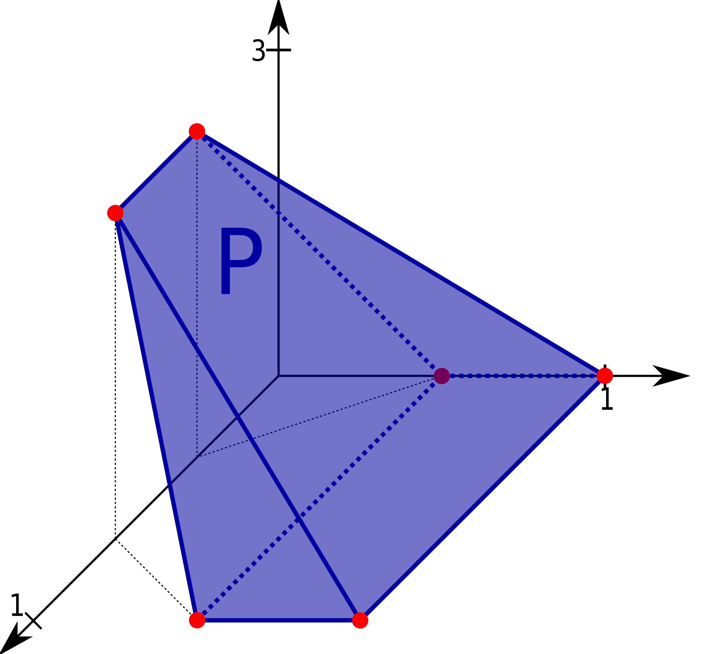

<head>
  <meta name="viewport" content="width=device-width, initial-scale=1">
   
</head>

<h1>More information coming soon!</h1>

## Schedule

| Talk Title | Date |
---------------------
| Talk 1 | (28 January -- 3 Februrary) |
| Talk 2 | 4 -- 10 Februrary |
| Talk 3| 11 -- 17 February |
| Talk 4 | 18 -- 24 February |
| Talk 5 | 25 February -- 2 March |
| Talk 6 | 3--9 March  |
| Talk 7 | 10--16 March |

